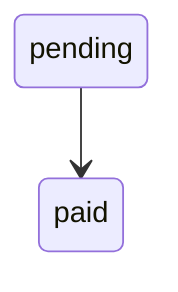

# context-hub-mcp

A local-first MCP server that turns a `.context/` folder of markdown files into a searchable knowledge layer for AI coding agents.

- write domain knowledge in markdown, keep it in git
- index it locally for fast retrieval
- expose it as MCP tools for Claude Code, Copilot, and other MCP clients

The markdown is the source of truth. SQLite is a local runtime index only — don't commit it.

## Quickstart

```bash
# 1. Scaffold the .context/ folder
npx context-hub-mcp init

# 2. Build the local index
npx context-hub-mcp reindex

# 3. Generate MCP client config
npx context-hub-mcp config --target claude-code --cwd /absolute/path/to/project
```

Paste the generated JSON into your MCP client config. The client will then invoke `serve` automatically — you don't need to run it manually.

## .context/ Structure

```text
.context/
├── schema.md               ← authoring conventions
├── domains/                ← business rules, workflows, state machines
├── integrations/           ← third-party APIs, auth, webhooks
└── pitfalls/               ← gotchas, lessons learned, failure modes
```

## Writing Knowledge

Every document needs YAML frontmatter:

````markdown
---
title: Payment Rules
domain: payments
tags: [payments, line-pay]
last_verified: 2026-03-28
confidence: high
---

# Payment Rules

## Key Files

- `src/payments/service.ts` - entrypoint

## Payment State Machine


````

Fields: `title`, `domain`, `tags`, `last_verified`, `confidence` (`high` / `medium` / `low`)

Use `Key Files` sections for source references and state machine headings so structured parsing picks them up.

## Importing Docs with Claude Code

If you use Claude Code, the repo includes a `/import_context` command that lets you turn any URL, wiki, or spec into a properly formatted `.context/` document:

```
/import_context https://stripe.com/docs/webhooks
/import_context the spec at ./docs/payment-rules.md
```

Claude will fetch the source, distill the relevant knowledge, pick the right subdirectory, and write the file with correct frontmatter. Run `npx context-hub-mcp reindex` afterward to update the index.

## MCP Tools

| Tool | Purpose |
|---|---|
| `list_domains` | Discover available knowledge areas |
| `search_context` | Full-text search across indexed documents |
| `get_context` | Read a specific document |
| `get_context_structured` | Read a document as structured data (keyFiles, stateMachines, pitfalls, sections) |
| `get_pitfalls` | List pitfalls, optionally filtered by domain |
| `annotate_context` | Leave a note on outdated or missing docs |
| `rate_context` | Mark whether a document was helpful |
| `list_annotations` | Review accumulated annotations |
| `reindex_context` | Force a fresh index rebuild |

## CLI

```bash
npx context-hub-mcp init       # scaffold .context/ workspace
npx context-hub-mcp reindex    # rebuild the local SQLite index
npx context-hub-mcp doctor     # inspect workspace health
npx context-hub-mcp config     # generate MCP client config JSON
npx context-hub-mcp serve      # run the MCP server (usually invoked by the client)
```

Run any command with `--help` for available flags.

## Client Setup

### Claude Code

```bash
npx context-hub-mcp config --target claude-code --cwd /absolute/path/to/project
```

<details>
<summary>Example output</summary>

```json
{
  "mcpServers": {
    "context-hub": {
      "command": "npx",
      "args": ["-y", "context-hub-mcp@latest", "serve", "--cwd", "/absolute/path/to/project"]
    }
  }
}
```
</details>

### GitHub Copilot

```bash
npx context-hub-mcp config --target copilot --cwd /absolute/path/to/project
```

<details>
<summary>Example output</summary>

```json
{
  "mcpServers": {
    "context-hub": {
      "type": "local",
      "command": "npx",
      "args": ["-y", "context-hub-mcp@latest", "serve", "--cwd", "/absolute/path/to/project"]
    }
  }
}
```
</details>

See also: [examples/claude-code.mcp.json](./examples/claude-code.mcp.json), [examples/copilot.mcp.json](./examples/copilot.mcp.json)

## Configuration

`context-hub.config.json` is optional. Defaults:

```json
{
  "contextDir": ".context",
  "dbPath": ".context/context_hub.db",
  "watch": true,
  "reindexDebounceMs": 250,
  "includeGlobs": ["**/*.md"],
  "excludeGlobs": ["**/.git/**"]
}
```

CLI flags override config file values. Relative paths resolve from `cwd`.

## Troubleshooting

**Search returns no results** — run `npx context-hub-mcp reindex`, then `npx context-hub-mcp doctor`. Common causes: missing `.context/`, malformed frontmatter, file outside indexed globs.

**Documents fail to parse** — check that all 5 frontmatter fields are present and valid.

**Database files appear in git** — ensure `.context/.gitignore` contains `context_hub.db`, `context_hub.db-shm`, `context_hub.db-wal`.

**Client cannot connect** — verify the client uses stdio MCP, the `--cwd` path is correct, and the project has been indexed at least once.

## License

MIT
