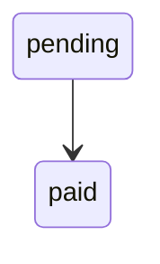

# context-hub-mcp

`context-hub-mcp` is a standalone, local-first MCP server for project knowledge stored in markdown.

It turns a `.context/` folder into a searchable knowledge layer that AI coding agents can query over MCP using local `stdio`. The markdown is the source of truth. SQLite is only a local runtime index and feedback store.

## What It Solves

Agents often miss domain rules because the important knowledge lives in scattered code, outdated prompts, or tribal knowledge. This package makes that knowledge explicit and reviewable:

- write domain knowledge in markdown
- keep it in git with the codebase
- index it locally for fast retrieval
- expose it as MCP tools for Claude Code, Copilot, and other MCP clients

This is useful across many stacks. The codebase can be Python, Elixir, Next.js, Go, or anything else. The only requirement is a project folder with `.context/*.md`.

## Core Idea

Context Hub has two layers:

1. `.context/*.md`
   This is the shared knowledge base for the team. It is the source of truth.
2. `.context/context_hub.db`
   This is a local SQLite index generated from the markdown. It exists to make search and tool calls fast.

That means:

- shared truth lives in markdown
- local runtime speed comes from SQLite
- agent feedback can be stored locally as annotations and ratings
- the database should not be committed; the markdown should

## How It Works

```text
AI client
  -> MCP tool call over stdio
  -> context-hub-mcp
  -> SQLite index
  -> markdown-backed knowledge
  -> tool result back to the client
```

Knowledge updates flow the other way:

```text
team edits .context/*.md
  -> git review / merge
  -> local reindex
  -> future MCP calls see the updated knowledge
```

## Quickstart

### 1. Initialize a project

```bash
npx context-hub-mcp init
```

When run in a terminal, `init` continues with an interactive setup flow that can:

- build the local index
- ask which MCP client you want to use with an interactive terminal menu
- write `./context-hub.mcp.json`
- tell you what to paste into your client config next

In non-interactive environments, `init` only scaffolds files and exits.

This scaffolds:

- `.context/schema.md`
- `.context/domains/example-domain.md`
- `.context/integrations/example-integration.md`
- `.context/pitfalls/example-pitfall.md`
- `.context/.gitignore`
- `context-hub.config.json`

### 2. Build the local index

If you skipped the interactive flow, run:

```bash
npx context-hub-mcp reindex
```

### 3. Generate MCP client config

If you skipped the interactive flow, run:

```bash
npx context-hub-mcp config --target claude-code --cwd /absolute/path/to/project
```

This prints ready-to-paste JSON for the selected MCP client. Use `--out <path>` if you want to write it to a file.

When you use the interactive `init` flow, this step is handled for you by writing `./context-hub.mcp.json`.

### 4. Point your MCP client at it

Paste the generated JSON into your MCP client config.

### 5. Run the MCP server

Once the client is configured, it will launch the server with `npx context-hub-mcp serve`.

## Typical Use

What you usually run depends on whether this is the first setup or normal day-to-day use.

### First-time setup for a project

```bash
npx context-hub-mcp init
npx context-hub-mcp reindex
npx context-hub-mcp config --target claude-code --cwd /absolute/path/to/project
```

Then paste the generated JSON into your MCP client config.

### Normal day-to-day use

- edit `.context/*.md`
- run `npx context-hub-mcp reindex` if needed
- use your AI client normally

You do not usually run `serve` yourself. Your MCP client starts `serve` when it needs the tools.

## Generated Structure

```text
.context/
├── .gitignore
├── schema.md
├── domains/
│   └── example-domain.md
├── integrations/
│   └── example-integration.md
└── pitfalls/
    └── example-pitfall.md
context-hub.config.json
```

Suggested directory meanings:

- `domains/` for business rules, workflows, state machines, and key files
- `integrations/` for third-party APIs and external service playbooks
- `pitfalls/` for expensive lessons, gotchas, and failure modes
- `schema.md` for shared authoring conventions

## CLI

### `init`

Scaffold a `.context/` workspace.

When run in a TTY, `init` can continue into an interactive onboarding flow that:

- reindexes the workspace
- lets you choose an MCP client target
- writes `./context-hub.mcp.json`
- reminds you that the AI client will invoke `serve` for you

```bash
npx context-hub-mcp init
```

Useful flags:

- `--cwd <path>`

### `reindex`

Re-scan `.context/` and rebuild the local SQLite index.

```bash
npx context-hub-mcp reindex
```

Useful flags:

- `--cwd <path>`
- `--config <path>`
- `--context-dir <path>`
- `--db-path <path>`

### `doctor`

Inspect workspace health.

```bash
npx context-hub-mcp doctor
```

Checks include:

- whether `.context/` exists
- whether SQLite is writable
- how many documents were indexed
- parse failures
- whether `.context/.gitignore` ignores DB files

### `config`

Generate MCP client config JSON.

```bash
npx context-hub-mcp config --target claude-code --cwd /absolute/path/to/project
```

Useful flags:

- `--target <name>`
- `--cwd <path>`
- `--name <value>`
- `--out <path>`
- `--list-targets`

Supported targets:

- `claude-code`
- `copilot`

By default the command prints JSON to stdout. Use `--out` to write the generated config to a file. Use `--name` to change the MCP server key from the default `context-hub`.

To see the supported targets from the CLI:

```bash
npx context-hub-mcp config --list-targets
```

### `serve`

Run the MCP server over local stdio.

```bash
npx context-hub-mcp serve
```

Most users do not need to run this command manually. Claude Code, Copilot, and other MCP clients call `serve` from the generated config when they need it.

Useful flags:

- `--cwd <path>`
- `--config <path>`
- `--context-dir <path>`
- `--db-path <path>`
- `--no-watch`

## Configuration

`context-hub.config.json` is optional. If omitted, sensible defaults are used.

```json
{
  "contextDir": ".context",
  "dbPath": ".context/context_hub.db",
  "watch": true,
  "reindexDebounceMs": 250,
  "includeGlobs": ["**/*.md"],
  "excludeGlobs": ["**/.git/**"]
}
```

Notes:

- relative paths are resolved from `cwd`
- `watch` controls auto-reindex while the stdio server is running
- `includeGlobs` and `excludeGlobs` define which markdown files are indexed

CLI flags override config file values.

## Writing Knowledge

Every document should start with YAML frontmatter:

````markdown
---
title: Payment Rules
domain: payments
tags: [payments, line-pay]
last_verified: 2026-03-24
confidence: high
---

# Payment Rules

## Key Files

- `src/payments/service.ts` - entrypoint

## Payment State Machine


````

Recommended rules:

- use `Key Files` for source references that agents should inspect next
- use headings like `Payment State Machine` so structured parsing can find diagrams
- keep `last_verified` current when behavior changes
- use `confidence` honestly: `high`, `medium`, or `low`

## MCP Tools

The server exposes these tools:

| Tool | Purpose |
| --- | --- |
| `list_domains` | Discover available knowledge areas |
| `search_context` | Full-text search across indexed documents |
| `get_context` | Read a specific document |
| `get_context_structured` | Read a document as structured JSON-friendly data |
| `get_pitfalls` | List pitfalls, optionally by domain |
| `annotate_context` | Leave a note on outdated or missing docs |
| `rate_context` | Mark whether a document was helpful |
| `list_annotations` | Review accumulated annotations |
| `reindex_context` | Force a fresh index rebuild |

`get_context_structured` extracts:

- `keyFiles`
- `stateMachines`
- `pitfalls`
- `sections`

This is especially useful when an agent wants machine-readable context instead of a plain text blob.

## Claude Code Setup

Generate config:

```bash
npx context-hub-mcp config --target claude-code --cwd /absolute/path/to/project
```

Example output:

```json
{
  "mcpServers": {
    "context-hub": {
      "command": "npx",
      "args": [
        "-y",
        "context-hub-mcp@latest",
        "serve",
        "--cwd",
        "/absolute/path/to/project"
      ]
    }
  }
}
```

To write the JSON directly to a file:

```bash
npx context-hub-mcp config --target claude-code --cwd /absolute/path/to/project --out ./context-hub.mcp.json
```

To change the MCP server name:

```bash
npx context-hub-mcp config --target claude-code --cwd /absolute/path/to/project --name docs-hub
```

After this config is added, Claude Code will invoke `serve` for you. You do not need a separate long-running terminal for Context Hub.

## GitHub Copilot Setup

Generate config:

```bash
npx context-hub-mcp config --target copilot --cwd /absolute/path/to/project
```

Example output:

```json
{
  "mcpServers": {
    "context-hub": {
      "type": "local",
      "command": "npx",
      "args": [
        "-y",
        "context-hub-mcp@latest",
        "serve",
        "--cwd",
        "/absolute/path/to/project"
      ]
    }
  }
}
```

This server is tool-focused, which maps well to Copilot's MCP usage model.

After this config is added, Copilot will invoke `serve` for you when needed.

## Architecture

```text
markdown docs in .context/
  -> indexer parses YAML frontmatter + markdown content
  -> store syncs SQLite + FTS + feedback tables
  -> MCP tools query the store
  -> stdio transport exposes the tools to the client
```

Runtime components:

- `src/core/config.ts` loads config and resolves paths
- `src/core/indexer.ts` scans and parses markdown docs
- `src/core/store.ts` manages SQLite, FTS search, feedback, and authoritative reindex
- `src/core/watcher.ts` auto-reindexes on markdown changes
- `src/tools/index.ts` registers MCP tools
- `src/transports/stdio/server.ts` runs the MCP server over stdio
- `src/cli/index.ts` provides `init`, `serve`, `reindex`, and `doctor`

## Source Of Truth vs Local Index

Treat the layers differently:

- `.context/*.md` is team-shared truth
- SQLite is local derived state
- annotations and ratings are local signals, not durable truth

If something important changes:

- update markdown
- commit it in git
- reindex locally

Do not treat the SQLite database as the reviewable knowledge source.

## Troubleshooting

### Search returns no results

Run:

```bash
npx context-hub-mcp reindex
```

Then:

```bash
npx context-hub-mcp doctor
```

Common causes:

- `.context/` is missing
- frontmatter is malformed
- the doc was added outside the indexed globs

### Documents fail to parse

Check that every markdown file has YAML frontmatter and valid fields:

- `title`
- `domain`
- `tags`
- `last_verified`
- `confidence`

### Database files appear in git

Make sure `.context/.gitignore` contains:

```text
context_hub.db
context_hub.db-shm
context_hub.db-wal
```

### The client cannot connect

Check:

- the client is using local stdio MCP, not HTTP
- the command is `npx ... serve`
- the `--cwd` path points to the project with `.context/`
- the project has been indexed with `reindex` at least once

## Limitations

v0.1 is intentionally narrow:

- local stdio only
- markdown-only data source
- no remote shared annotation storage
- no prompts/resources support yet
- structured parsing is heuristic-based and works best with consistent headings

## Example Files

See:

- [examples/claude-code.mcp.json](./examples/claude-code.mcp.json)
- [examples/copilot.mcp.json](./examples/copilot.mcp.json)

## Maintainer Release

For manual GitHub + npm releases:

```bash
npm run prepublish-check
```

This runs tests, typecheck, build, and `npm pack --json` before publish. The full maintainer workflow is documented in [docs/releasing.md](./docs/releasing.md).

## License

MIT
